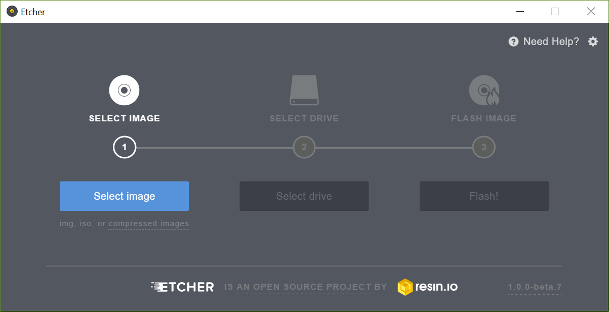

# 라즈베리파이에 우분투 설치

## 1. 준비물
- 라즈베리파이 
- Micro SD card (8GB~)
- SD 카드 커넥터
- 노트북 -> 와이파이 필요
- HDMI 선
- 모니터(데스크탑 모니터 or TV or 라즈베리 전용 모니터)
- USB 키보드 & 마우스

## 2. 설치

### 2.1 라즈베리 우분투 이미지 다운로드
- 다음 링크에서 우분투 메이트 이미지를 다운로드 해줍니다.(16.04 LTS)
<https://ubuntu-mate.org/download/>

### 2.2 SD카드에 이미지 입히기
- 우선 SD 카드를 포맷 시켜줍니다.
- 이미지 입히는 프로그램인 etcher를 다운로드합니다.
<https://etcher.io/>
- etcher를 실행시켜 줍니다.

- 실행하고 select image를 눌러 다운받은 이미지를 선택해 줍니다.
- 그다음 select drive에서 SD카드를 선택해 줍니다.
- 마지막으로 Flash를 눌러줍니다.(약 10분 정도 걸립니다.)

## 3 라즈베리파이에서 실행 시키기
- SD 카드를 컴퓨터에서 제거한 다음 라즈베리 뒷면에 넣습니다.
- hdmi 선을 연결해줍니다.
- 마우스와 키보드도 연결해 줍니다.
- 전원을 연결하여 실행 시켜줍니다.
- 처음 켜지면 시스템 설정에서 언어를 선택할 수 있습니다.(English 선택 언어 오류 방지)
<>
- 국가설정 대한민국 클릭
<>
- 키보드 설치 영어 선택
- 다음 필드값 모두 입력 (이름과 암호는 잊어버리지 않기!!)
<>
- 설정을 다 하면 우분투가 시작됩니다.
