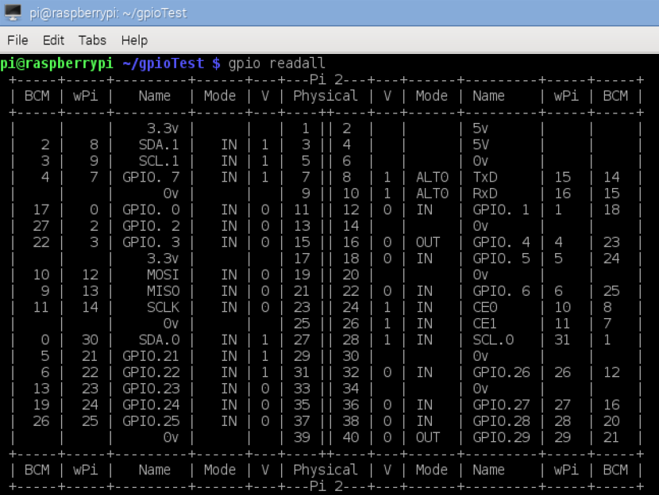
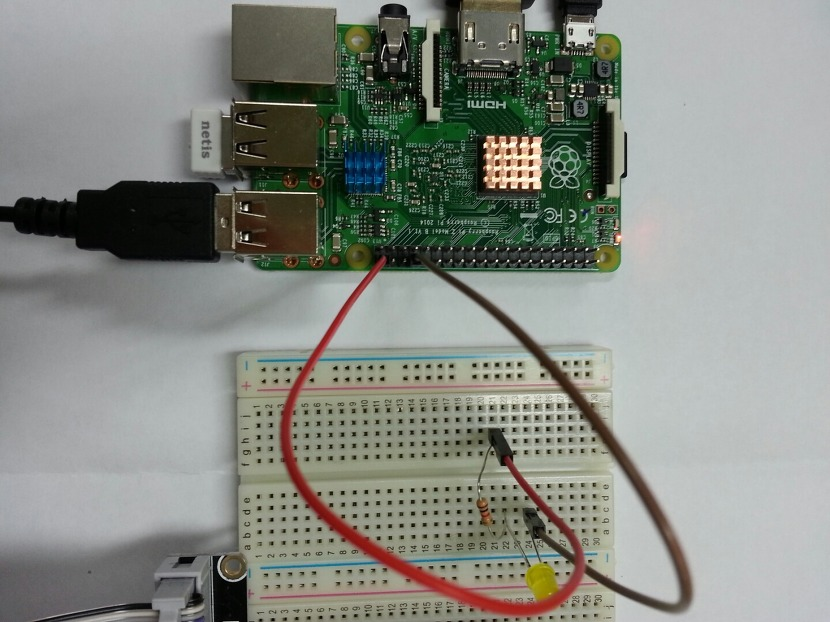

# 라즈베리파이로 LED on/off 하기 (GPIO)

## 1. 준비물
- 라즈베리파이
- LED 1개 이상
- 암암 전선 2개 or 암수 전선 2개 와 브레드보드(빵판)


## 2. 개념
* GPIO란?
```
GPIO는 General-purpose input/output의 약자로, 사전에 약속되지 않은 회로의 행동을 제어하기위한 핀입니다.
사용자가 직접 회로를 구성하고 프로그래밍하여 라즈베리파이의 GPIO를 다룰수있습니다.
```


## 3. WiringPi 설치
- gpio를 다루기 전에 먼저 필요한 툴과 라이브러리를 다운 받습니다.

- 쉘에서 명령어를 실행합니다.
- 소스관리툴
```$ sudo apt-get install git-core```
- wiringPi 프로젝트를 다운 받습니다.(gpio를 다루는 라이브러리)
```$ git clone git://git.drogon.net/wiringPi ```
- wiringPi 디렉터리에 들어갑니다.
```$ cd wiringPi```
- wiringPi 설치합니다.
```$ ./build ```
- 설치 잘 되었는지 확인
```$ gpio -v gpio readall```


## 4. 라즈베리파이 gpio 확인하기
- 아래 사진은 라즈베리파이의 gpio 핀 입니다.
- 40번 쪽이 usb 포트가 있는 곳 입니다.


- 자신의 gpio 확인
```$ gpio readall ```



## 5. 회로 구성하기

- LED에서 긴 다리 (+)를 gpio 21번에 연결한다.
- 짧은 쪽은 가장 가까운 그라운드(GND)에 연결해 준다.


## 6. 프로그래밍 하기
- 파일을 LED.c라는 파일을 만듭니다.
```
$ nano LED.c
```
```
#include<stdio.h>

#include<wiringPi.h> //wiringPi.h헤더파일을 추가시킵니다.

int main()

{

	int i;


	if(wiringPiSetup()==-1) return -1; //wiringPi를 설정하는 함수입니다. 만약 설정되지 않았다면 -1이 리터되어 메인함수가 종료합니다.

	

	pinMode(29,OUTPUT); //핀모드를 29번으로 설정합니다.(BCM으로 21번이 wiringPi에서 29번이므로)

	for(i=0;i<5;i++) //for문을 이용하여 동작을 5번 실행합니다.

	{

		digitalWrite(29,1); //led를 켭니다.(1)

		delay(500); //0.5초 지연

		digitalWrite(29,0); //led를 끕니다.(0)

		delay(500); //0.5초 지연

	}

	return 0;

}
```


## 7. compile & 실행
- 컴파일
```$ gcc -o LED LED.c -lwiringPi```
- 실행
```$ sudo ./LED ```


## 출처
<http://gma-log.tistory.com/75>