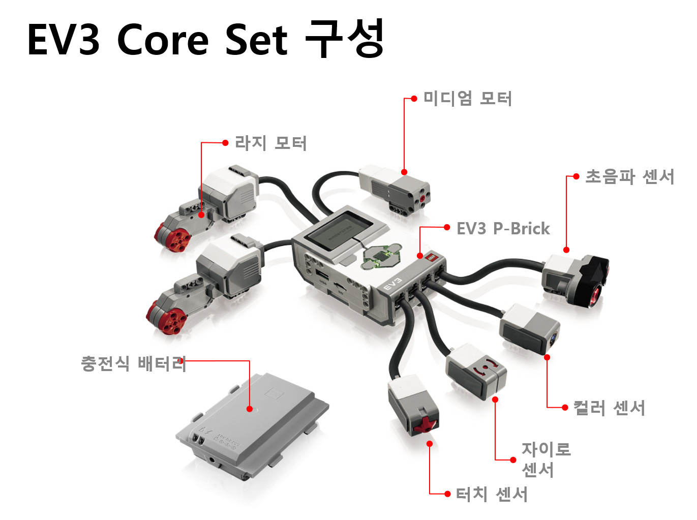
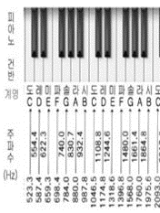
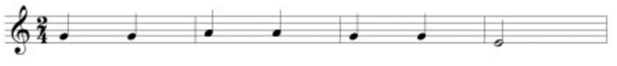
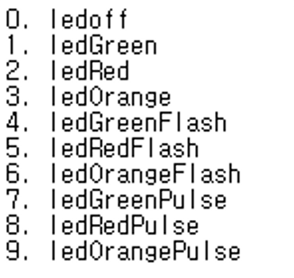
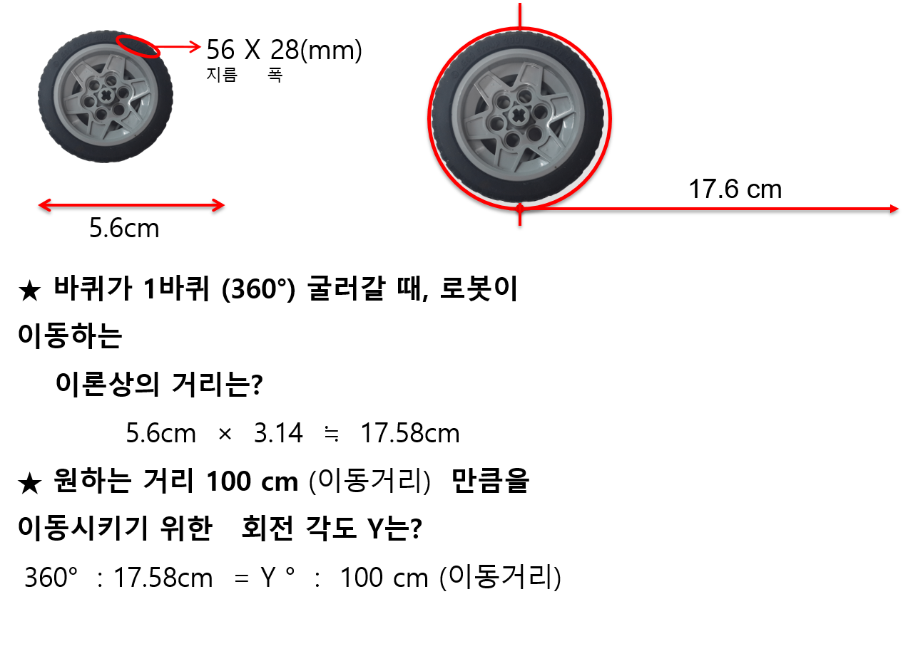
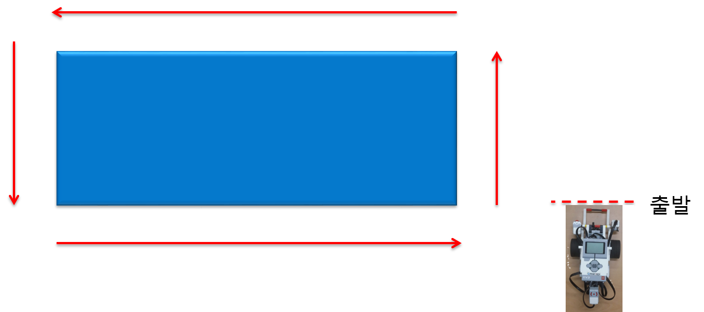

# ev3 programming Using C

## 1. 배경 지식
- ev3 기본 set


* RobotC 특징
	* 가장 널리 사용되는 C언어 기반의 문법으로 프로그래밍 가능 
	* 최적의 성능을 제공하는 자체 최적화한 LEGO Mindstorms EV3 펌웨어 사용 
	* 런탐이 디버깅 기능 제공 
	* LEGO® Mindstorms® EV3뿐만 아니라 CORTEX, Arduino 등 다양한 로봇 플 랫폼을 지원 (플랫폼별 라이센스는 별도 구매) 
	* RobotC는 상용 프로그램이지만 10일의 평가판 제공 
	* 자연어 라이브러리 지원 


* 자연어 (Natural Langauge)?
	* New, developed specifically for PLTW
	* Goal is to lower the barrier of entry into syntax-based programming by
	  simplifying the code and using more "natural" command names
	* Lines of code for common robot behaviors are consolidated
	  into single commands

-- <http://slideplayer.com/slide/9138174/>


## 2. 프로그래밍

### 2.1 Brick Sound

- 피아노 건반을 참고하여 원하는 음을 1초 재생한다.

	- brick_sound1.c

- '학교 종이 땡땡땡' 연주

	- brick_sound2.c

- playSound(사운드 이름);
	- brick_sound3.c

- 설정한 사운드 파일 재생
	- 사운드 파일 경로: C:/Program Files(x86)/Robomatter Inc/ROBOTC Development Enviroment 4.X/EV3 System Files/Sounds
	- brick_sound4.c


### 2.2 Brick Light

- 해당하는 숫자의 컬러 출력
```
setLEDColor(color number);
```

- color number

- 브릭을 1초 동안 빨간색으로 켜보기
	- brick_light1.c

- 교통 신호등 만들기
	- brick_light2.c


### 2.3 Brick Display

- LCD 창에 텍스트나 그래픽을 표시
```
displayTextLine(LCD위치, “출력내용”); //출력 내용을 display창에 출력
displayCenteredTextLine(LCD위치, “출력내용”); //출력 내용을 display창 가운데 출력
displayCenteredBigTextLine(LCD위치, “출력내용”);	//출력 내용을 display창 가운데에 크게 출력
drawBmpfile(X, Y, “이미지 파일”); // 지정한 X,Y 위치에 이미지 파일 출력
```

- 원하는 문구 LCD에 출력
	- brick_display1.c

- 이미지 파일을 LCD창에 출력
	- 이미지 파일 경로: C:/Program Files(x86)/Robomatter Inc/ROBOTC Development Enviroment 4.X/EV3 System Files/Images
	- brick_display2.c


- 신호등 만들기
	- brick_display3.c


### 2.4 Large Motor

- 모터는 파워는 -100~100까지고 양수,음수 따라 회전 방향 바뀐다.
- 정방향 CW, 역방향 CCW
- 사용 함수
```
motor[모터 이름]=파워;   //지정한 파워로 모터가 움직인다.
setMotorSpeed(모터 이름, 속도);
setMotorTarget(모터 이름, 회전 각도, 속도); 
moveMotorTarget(모터 이름, 회전 각도, 속도); 
setMotorBrakeMode(모터 이름, 모드 설정);
waitUntilMotorStop(모터이름);
```

#### 라지 모터
- B와 C 포트에 연결된 라지 모터를 2초동안 30 파워로 전진
```
task main() {
	motor[motorB] = 30;
	motor[motorC] = 30;
	wait1Msec(2000);
}
```
- B와 C 포트에 연결된 라지 모터를 2초동안 30 파워로 후진
```
task main() {
	motor[motorB] = -30;
	motor[motorC] = -30;
	wait1Msec(2000);
}
```

#### 회전
- 스윙턴(Swing turn)
```
task main() {
	motor[motorB] = 50;
	motor[motorC] = 0;
	wait1Msec(2000);
}
```
- 포인트 턴(Point turn)
```
task main() {
	motor[motorB] = 50;
	motor[motorC] = -50;
	wait1Msec(2000);
}
```
- 커브 턴(Curve turn)
```
task main() {
	motor[motorB] = 50;
	motor[motorC] = 20;
	wait1Msec(2000);
}
```

#### Encoder
- 50의 속도로 바퀴를 360도 회전
```
task main() {
	setMotorTarget(motorB, 360, 50);
	wait1Msec(1000);
}
```
- 50의 속도로 바퀴를 360도 회전
```
task main() {
	moveMotorTarget(motorB, 360, 50);
	wait1Msec(1000);
}
```
- 두 예제의 차이점은?
```
???
```
- 50의 속도로 바퀴를 360도 두 번 회전
```
task main() {
	setMotorTarget(motorB, 360, 50);
	wait1Msec(1000);
	setMotorTarget(motorB, 360, 50);
	wait1Msec(1000);
}
```
- 50의 속도로 바퀴를 360도 두 번 회전
```
task main() {
	moveMotorTarget(motorB, 360, 50);
	wait1Msec(1000);
	moveMotorTarget(motorB, 360, 50);
	wait1Msec(1000);
}
```

- 로봇이 절벽에 최대한 가까이 가서 멈추게 하기
- 계산 방법

- code
```
task main(){
	moveMotorTarget(motorB,500,50);
	moveMotorTarget(motorC,500,50);
	waitUntilMotorStop(motorB);
	waitUntilMotorStop(motorC);
}
```

- 사각형 박스를 따라 회전하기


#### Brake
- 부드럽게 정지하기
```
task main(){
	setMotorBrakeMode(motorB,0);
	motor[motorB]=100;
	wait1Msec(1000);
}
```
```
setMotorBrakeMode(모터이름,  mode);
	mode = 0 → 부드럽게 정지
	mode = 1 → 급격하게 정지
```
