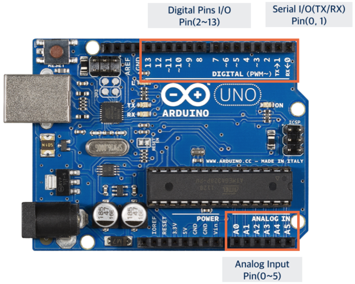
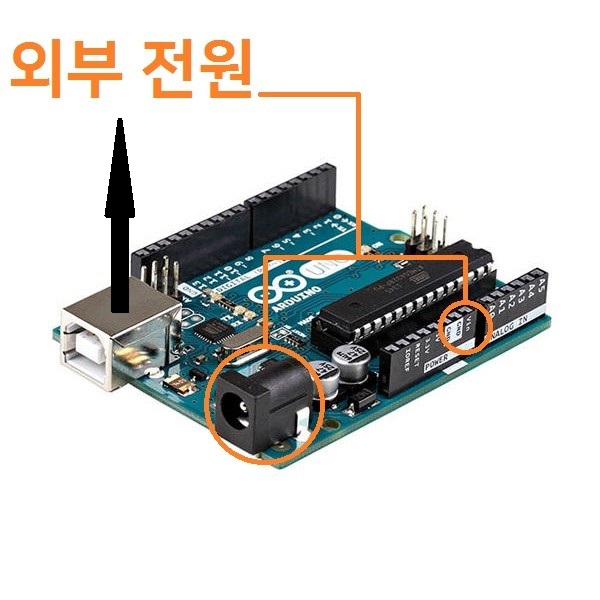

# 1. Arduino 란?
오픈 소스를 기반으로 한 단일 보드 마이크로컨트롤러로 완성된 보드(상품)와 관련 개발 도구 및 환경을 말한다.
<img_src ="./pic/Arduino_Uno.jpg">

# 2. Arduino 구조
## 2.1 핀 배열

- 아두이노 핀은 GND, VCC, Digital, Analog 가 있다.

* digital: 
	- 사진 위쪽에 2번부터 13번까지가 digital 핀으로 사용할 수 있는 부분이다. 
	- 디지털은 0과 1로 불연속적인 값을 줄 수 있다.

* analog:
	- 아날로그의 input 핀은 하단의 A0~A5까지이다.
	- 아날로그는 연속적인 값을 받을 수 있다.
	- 아날로그의 output 핀은 상단에 번호 앞에 ~ 표시가 있는 핀들이다.
	- ~표시가 있는 핀은 pwm(Pulse width modulation)을 내보낼 수 있는데 
	   0과 1을 작은 시간간격으로 조절해 연속적인 값을 주는 것이다.

* VCC:
	- 이 핀은 전기를 내보내는 핀이다.
	- 3.3V와 5V가 있다.

* GND:
	- 전기를 받아들여 버리는 곳이다.
	- 회로는 한 바퀴 회전을 해야하기 때문에 나가는 곳도 있어야한다.

## 2.2 전원 입력부
아두이노의 전원 입력부는 3곳이 있다.

그림에 보이는 2군데와 옆쪽에 은색으로 튀어나와 있는 부분이다.
2군데 중 하나는 핀에서 VIN에 해당한다.
3군데 중 어느 한 곳만 연결해도 전원이 들어온다.

