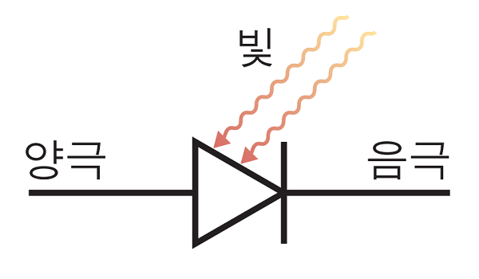
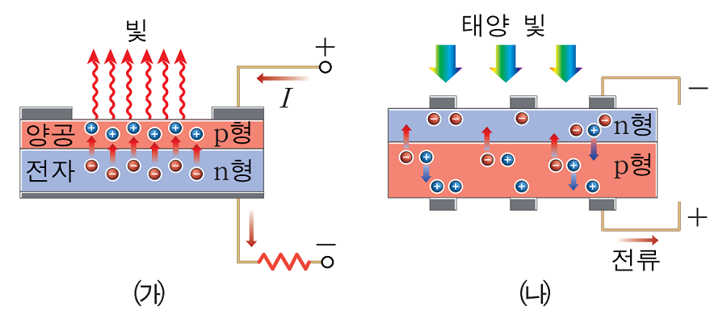
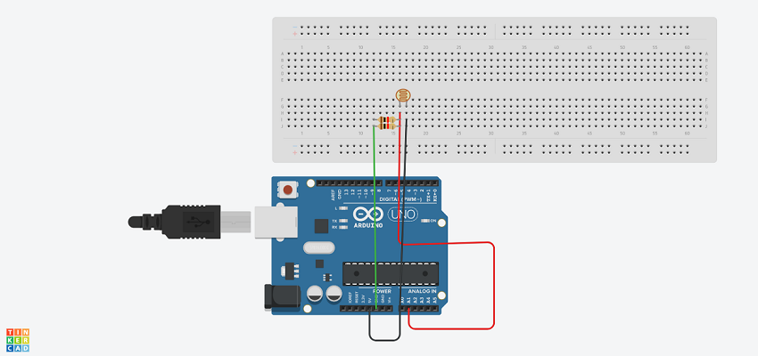
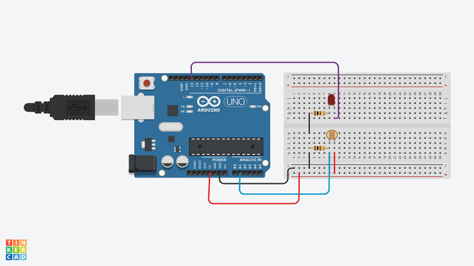
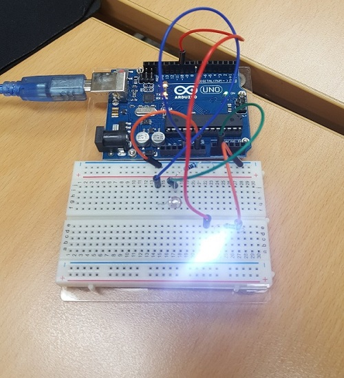

# 1.CDS Sensor
- 광센서, 조도센서로 불리며 광전효과를 이용하여 빛의 양을 알아내는 장치로 빛 신호를 전기 신호로 바꾸어 줌.

- 광 다이오드: p형 반도체와 n형 반도체의 접합 구조로 되어 있으며, p-n 접합부에 빛을 비추면 광전 효과에 의해 전류가 흐른다. 
			이때 흐르는 전류는 빛의 세기에 비례함

# 2.CDS_LED_digital

## 회로도
- CDS는 연결방향에 관계없이 사용 가능하다.

- 이 사진과 같이 회로를 구성하고 진행한다.
- LED는 긴 다리가 + 이다.

## sketch Code
- 코드는 폴더 내의 CDS_LED_digital_sketch 코드를 보세요.
- 이번은 13번에 LED를 연결합니다.

# 3.CDS_LED_analog

## 회로도
- digital 회로에서 LED를 13번에서 10번으로 이동시킨다.

## sketch Code
- 코드는 폴더 내의 CDS_LED_analog_sketch 코드를 보세요.

## 4. 시리얼 모니터 & 플로터
- 시리얼 모니터를 보려면 아두이노 우측 상단 돋보기 표시를 누르면 나온다. (전송속도를 일치 시켜주어야함)
- 시리얼 플로터는 시리얼 결과를 그래프로 보여준다.
	- 툴 -> 시리얼 플로터

# 완성 사진

