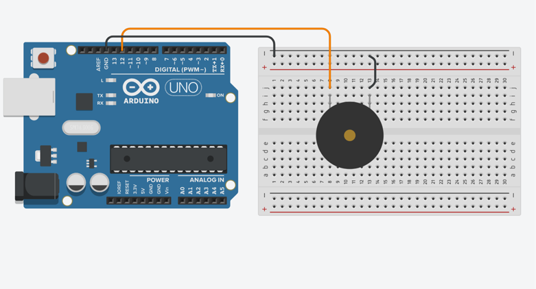
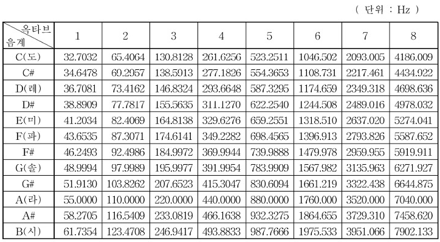
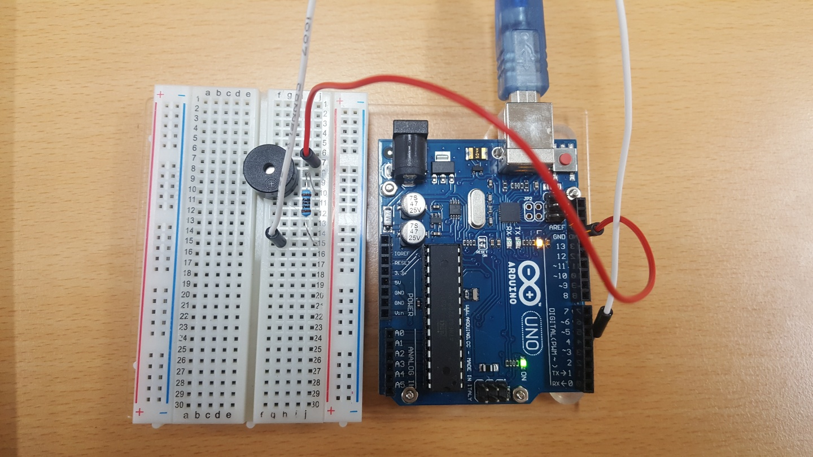

# 1. 피에조 스피커
- 피에조 스피커는 피에조 효과를 이용하여 소리를 내는 작은 스피커입니다.(피에조 부저라고도 합니다.)
- 피에조 효과:
	- 수정이나 세라믹 같은 결정체의 성질을 이용하는 것으로 압력을 주게되면 변형이 일어나면서 표면에 전압이 발생하고, 반대로 전압을 걸어주면 응축,신장을 하는 현상을 말하며 압전효과라고도 합니다. 
	- 여기에 얇은 판을 붙여주면 미세한 떨림으로 소리가 나게 됩니다.
	- 피에조 부저는 큰 소리를 내지 못 하는 단점이 있으나, 값이 싸고 단순하며, 주파수 2만Hz 이상의 초음파를 발생시킬 수 있기 때문에 초음파을 활용한 다양한 제품에서 사용됩니다.

# 2. 회로도
- 피에조 부저는 +라고 써져 있거나 다리가 긴 쪽에 +를 연결 하면 됩니다.

# 3. 프로그램
- 프로그램 코드는 "학교 종이 땡땡땡"과 "슈퍼마리오 주제곡"이 있다.

- 다음은 음계별 표준 주파수 이다.

# 4. 실제 사진
