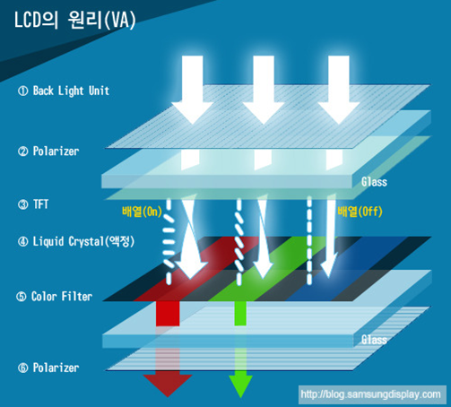
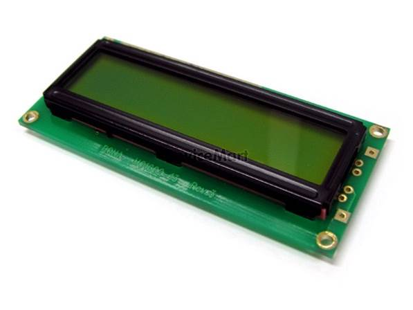
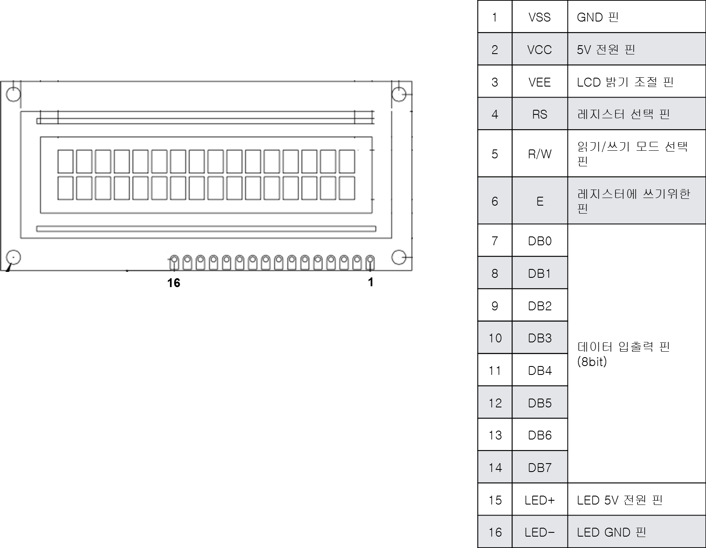
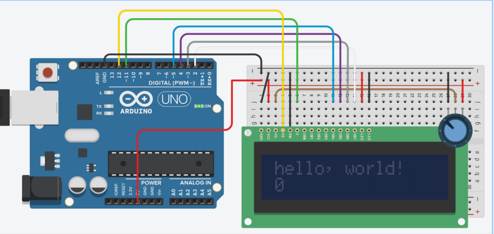
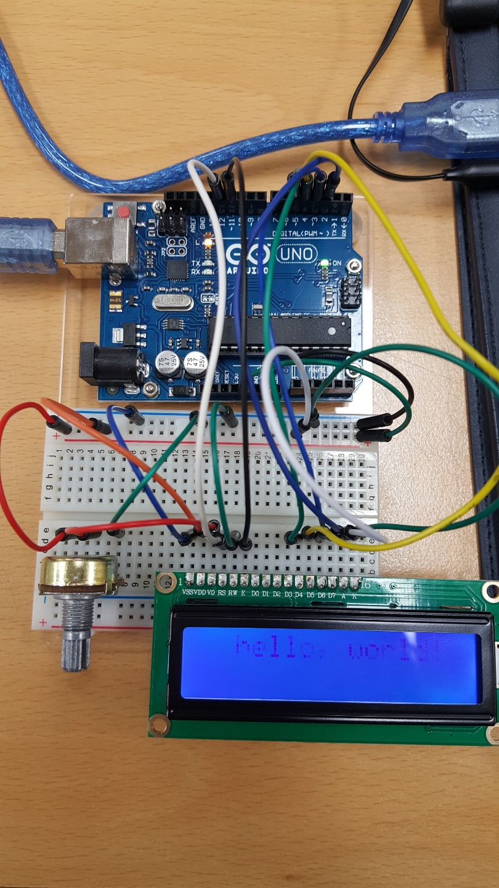

# LCD 사용하기

## 1. LCD 란?
- LCD는 Liquid Crystal Display의 약자로 액정표시장치를 말합니다.
- 액정 (Liquid Crystal)이란 액체처럼 유체의 성질을 가지면서 고체처럼 광학적 성질을 가지는 물질입니다. 
- 또한 액정은 고체표면에 액정이 특정 방향으로 정렬할 수 도 있어, 전기적 신호를 가해 원하는 방향으로 배열하여 빛을 투과시키거나 차단시킬 수 있습니다.



- LCD는 얇고 가벼우며 소비전력이 적은 장점은 있지만, 시야각이 제한적이고 어두운 곳에서는 선명함이 떨어지는 단점이 있습니다. 
- 현재 LCD는 손목시계부터 TV에 이르기까지 광범위하게 활용되고 있습니다.



## 2. 준비물
- LCD (납땜 필요)
- 아두이노, 가변저항, 브레드 보드
- 점퍼케이블 10개


## 3. 회로도
- 사용방법
	- 16개의 문자를 2줄로, 총 32개 문자를 표현할 수 있는 LCD를 사용



- 회로도



## 4. 코드

- HelloWorld_LCD 폴더에 올려두었다.
- 화면에 HelloWorld 글자를 출력하는 것이다.

- LCD 함수들
```
lcd.begin();	LCD를 사용을 시작
lcd.display();	LCD에 내용을 표시
lcd.noDisplay();	LCD에 내용을 숨김
lcd.setCursor(col,row);	row, col의 좌표로 커서를 위치
lcd.cursor();	LCD에 커서를 표시
lcd.noCursor();	LCD에 커서를 숨김
lcd.home();	커서의 위치를 0,0으로 이동
lcd.blink();	커서를 깜빡임
lcd.noBlink();	커서를 깜빡이지 않음
lcd.backlight();	LCD backlight을 킴
lcd.noBacklight();	LCD backlight를 끔
lcd.write(val);	LCD 화면에 val 출력(아스키 코드 입력 시에는 아스키 코드에 해당하는 문자 출력)
lcd.print(val);	LCD 화면에 val 출력
lcd.clear();	LCD 화면의 모든 내용 지움
lcd.scrollDisplayRight();	내용을 우측으로 1칸 이동
lcd.scrollDisplayLeft();	내용을 좌측으로 1칸 이동
lcd.autoscroll();	내용을 자동으로 우에서 좌로 스크롤
```

## 완성 사진

