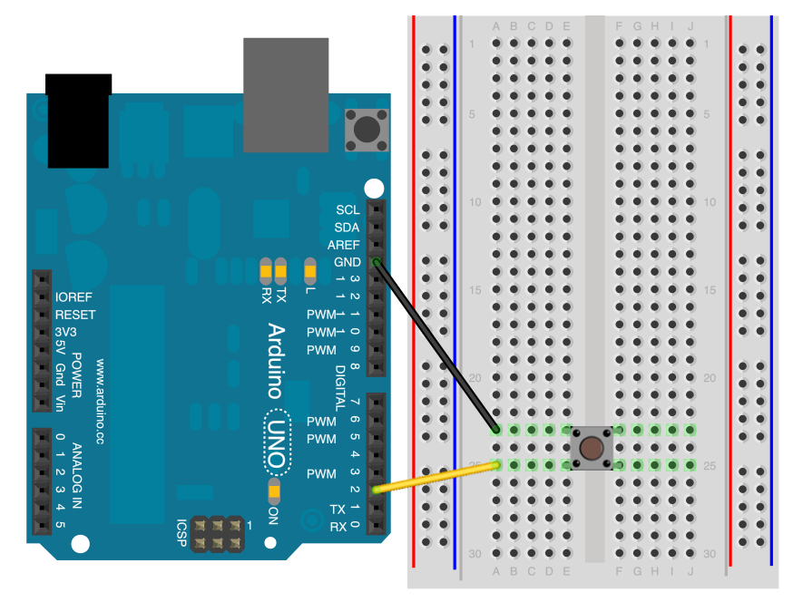
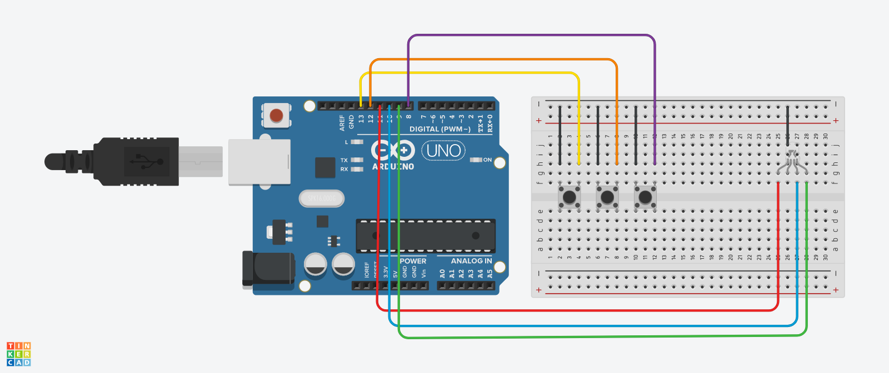
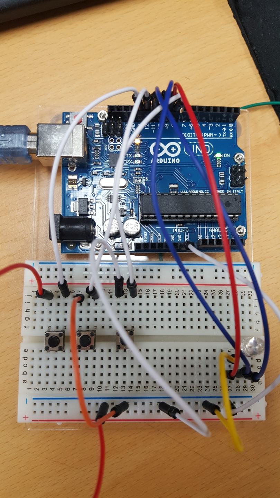

# Button & RGB LED

## 1. Button
- button에서 PULLUP과 PULLDOWN에 관한 이론은 따로 올렸습니다.
- <0319_PULL-UP 풀업 저항, PULL-DOWN 풀다운 저항> 
- <https://github.com/robo0801/embedded/blob/master/%EC%A0%95%EB%B3%B4%EA%B3%BC%ED%95%99%20%ED%94%84%EB%A1%9C%EC%A0%9D%ED%8A%B8/0319_PULL-UP%20%ED%92%80%EC%97%85%20%EC%A0%80%ED%95%AD%2C%20PULL-DOWN%20%ED%92%80%EB%8B%A4%EC%9A%B4%20%EC%A0%80%ED%95%AD/Floating.md#floating-%ED%98%84%EC%83%81%EA%B3%BC-pull-up--pull-down>

## 2. Button 내부 PULLUP 사용

### 2.1 기초 설명
- pinMode() 함수에 INPUT_PULLUP 파라미터를 사용해서 내부 풀업 저항을 사용하는 방법
- 아두이노 내부 풀업 저항을 사용하면 저항 없이도 간편하게 버튼을 연결할 수 있습니다. 
- 사용자가 버튼을 누르면 Serial 통신으로 PC로 상태 값을 전송하며 아두이노 보드에 내장된 LED (13번 핀에 연결된) 를 on/off 시킵니다.

### 2.2 연결방법

- 풀업 저항을 직접 만들어서 사용하는 경우 VCC와 버튼 사이에 저항을 넣고, 저항과 버튼 사이에서 선을 빼서 2번 핀으로 연결하는 형태가 됩니다. 
- 여기서는 단순하게 2번 핀 – 스위치 – GND 로 연결하는 대신 2번 핀 내부의 풀업 저항을 활성화 시킵니다.
- 버튼을 누르지 않은 상태(open 상태) 에서는 2번 핀 내부의 풀업 저항이 활성화 되면서 5V로 연결됩니다. 
- 따라서 2번 핀의 값을 읽으면 HIGH 값을 읽을 수 있습니다.
- 버튼을 누를 경우 2번 핀과 GND의 연결이 종료되는 효과가 생기므로 LOW 값을 읽을 수 있습니다.

### 2.3 소스코드

- button_pullup 폴더에 첨부하였습니다.
- setup 부분에서 pinMode(2, INPUT_PULLUP); 이 부분을 자세히 봐주세요.

## 3. RGBLED를 사용한 Button 응용

### 3.1 기초 설명
- 버튼 3개를 이용하여 LED 색을 바꿔보는 프로그램이다.
- RGBLED는 아날로그로 다양하게 색을 조절할 수 있지만 Digital로 RGB만 켰다 끌 수도 있다.

### 3.2 아두이노 회로도
- 다음 사진과 같이 연결하면 된다.

- 여기서 LED는 RGB를 연결하였고 가장 긴 다리는 GND에 연결하면 된다.

### 3.3 코드
- button_3LED 에 코드를 첨부하였다.
- 버튼을 누르고 있을 때 반응하여 불이 켜지고 아니면 불이 꺼진다.
- 동시에 여러개를 누르면 섞인 색이 나온다.

## 4. 완성 사진

