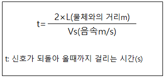
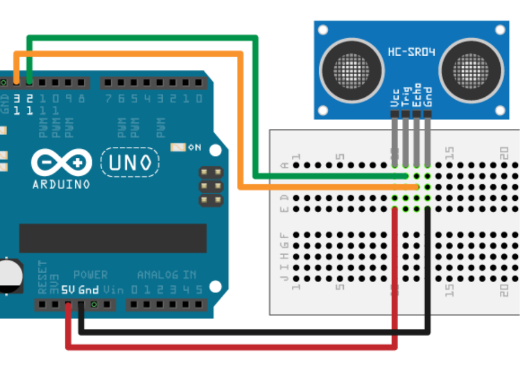
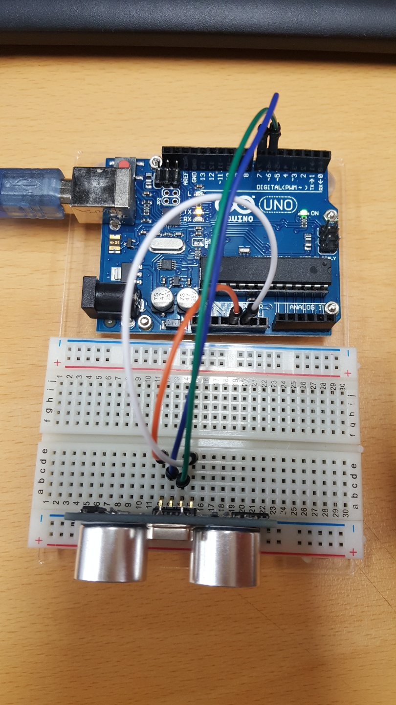

# 초음파 센서 사용

## 1. 초음파 센서의 원리
- 인간의 들을 수 있는 영역 (가청영역) 은 약 20~20KHz이며, 이것보다 주파수가 더 높은 음을 초음파 (Ultrasonic)라고 합니다.
- 개인적인 차이가 있으나, 일반적인 성인은 20KHz 이상의 높은 소리는 듣지 못 합니다.

- 초음파는 음속으로 약 340 m/s 입니다.

- 거리측정을 위한 초음파 센서는 송신부와 수신부로 나뉘어져 있다.
- 송신부에서 일정한 시간의 간격을 둔 짧은 초음파 펄스를 방사하고 대상물에 부딪혀 돌아온 에코 신호를 수신부에서 받아, 이에 대한 시간차를 기반으로 거리를 산출합니다.
- 이를 통해 장애물의 유무, 물체의 거리 또는 속도 등을 측정할 수 있습니다.

- 계산 방법

## 2. 준비물
- 아두이노, 초음파 센서, 암수 전선 4개, 수 전선 4개
- 브레드 보드, LED

## 3. 회로도
- 초음파 센서에는 4개의 핀이 있는데 양 옆에 VCC와 GND는 5V와 GND에 각각 연결한다.
- Trig는 7번 Echo 는 6번에 연결해줍니다.

## 4. 소스코드
- 폴더 <ultrasonic_sensor> 에 있습니다.

distance = (double)duration / 29.0 / 2.0;
- 이 부분에서 시간을 거리로 바꿔줍니다.

## 5. 완성 사진

